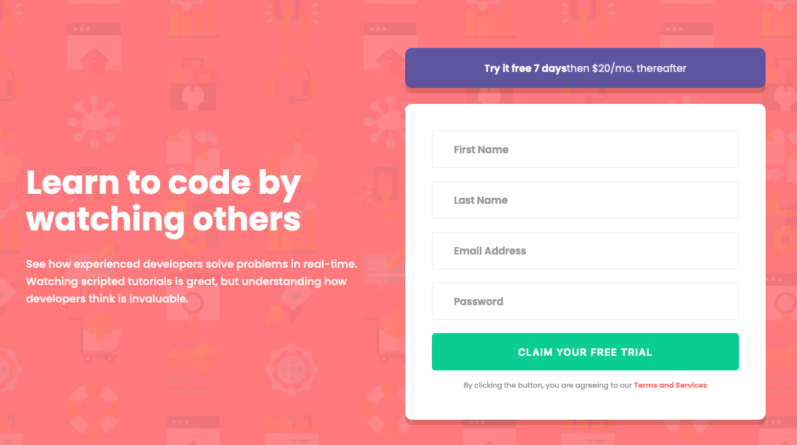

# Frontend Mentor - Intro component with sign up form solution

This is a solution to the [Intro component with sign up form challenge on Frontend Mentor](https://www.frontendmentor.io/solutions/responsive-login-form-using-react-and-sass-Pjr0rKJQj). Frontend Mentor challenges help you improve your coding skills by building realistic projects.

## Table of contents

- [Frontend Mentor - Intro component with sign up form solution](#frontend-mentor---intro-component-with-sign-up-form-solution)
  - [Table of contents](#table-of-contents)
  - [Overview](#overview)
    - [The challenge](#the-challenge)
    - [Screenshot](#screenshot)
    - [Links](#links)
  - [My process](#my-process)
    - [Built with](#built-with)
    - [What I learned](#what-i-learned)
    - [Continued development](#continued-development)
    - [Useful resources](#useful-resources)
  - [Author](#author)

## Overview

### The challenge

Users should be able to:

- View the optimal layout for the site depending on their device's screen size
- See hover states for all interactive elements on the page
- Receive an error message when the `form` is submitted if:
  - Any `input` field is empty. The message for this error should say _"[Field Name] cannot be empty"_
  - The email address is not formatted correctly (i.e. a correct email address should have this structure: `name@host.tld`). The message for this error should say _"Looks like this is not an email"_

### Screenshot



### Links

- Solution URL: [www.frontendmentor.io/solutions/responsive-login-form-using-react-and-sass-Pjr0rKJQj](https://www.frontendmentor.io/solutions/responsive-login-form-using-react-and-sass-Pjr0rKJQj)
- Live Site URL: [intro-component-with-signup-form-master-rose-chi.vercel.app](https://intro-component-with-signup-form-master-rose-chi.vercel.app/)

## My process

- Used Figma to find dimensions of main elements (titles, left and right panels, etc.)
- Built the html
- Built the css for **desktop** resolution
- Converted the project to React
- Added all the states for the inputs to check errors
- Built the css for **mobile** resolution

### Built with

- Semantic HTML5 markup
- CSS custom properties
- Sass/Scss
- Flexbox
- Mobile-first workflow
- [React](https://reactjs.org/) - JS library

### What I learned

I learned how to use States to manage input errors in the form.

```js
import React, { useState } from 'react';

const [firstname, setFirstname] = useState('');
const [lastname, setLastname] = useState('');
const [email, setEmail] = useState('');
const [password, setPassword] = useState('');
```

In terms of form submission, I used `noValidate` to get rid of the browser validation.

```js
<form className="right-panel__form" onSubmit={submit} noValidate>
```

For email validation, I used the package `(email-validator)[https://github.com/manishsaraan/email-validator]`

```js
import EmailValidator from 'email-validator';
```

### Continued development

- 🔲 When users land on this page, they don't necessarily know that this is just a frontendmentor challenge and that the goal is to purely practice frontend skills.<br>
  I will add either a popup or a small banner on the top to explain the goal of the page.
- 🔲 When users are submitting the form, for now it doesn't do anything and this leads to confusions as users are expecting for something to happen when they click on the submit button.<br>
  I will add a confirmation message using React to satisfy users' expectations 😄

### Useful resources

Firefox add-ons that I used to create a pixel perfect version of this website:

- [Pixel Perfect Pro](https://addons.mozilla.org/en-US/firefox/addon/pixel-perfect-pro/) - This helped me to display a screenshot on top of the webpage to easily check if dimensions were accurate.
- [PX: Viewport Dimensions](https://addons.mozilla.org/en-US/firefox/addon/px-viewport-dimensions/) - This add-on will show you the dimensions of your viewport while resizing your browser.

Other tools:

- [Gimp](https://www.gimp.org/) - This helped me resize screenshots provided in the project
- [Figma](https://www.figma.com) - This helped me create a rapid mockup to get dimensions of components.

## Author

- Frontend Mentor - [@melwynt](https://www.frontendmentor.io/profile/melwynt)
- Twitter - [@melwyncode](https://www.twitter.com/melwyncode)
